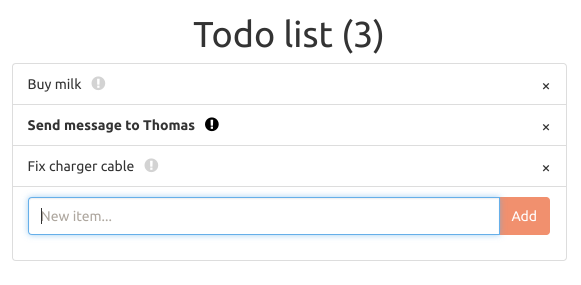

Typical TODO app. I wrote this once, then after 3 months I came back to look at the code and I was horrified. This version uses Spring Boot, React and Redux (ES6), with Bootstrap components.

To run, use `./gradlew bootRun`, which should take care of everything, including building frontend. To run just frontend in development mode (with hot reloading and stuff), use `cd frontend; npm start`. Run backend integration tests with `cd integration; jasmine-node .`.

